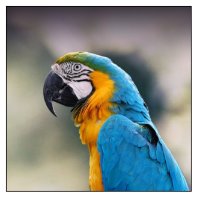
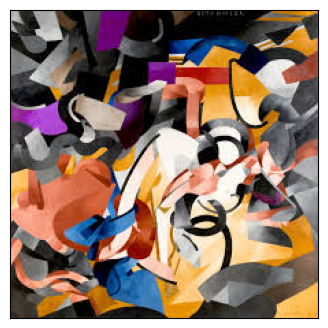
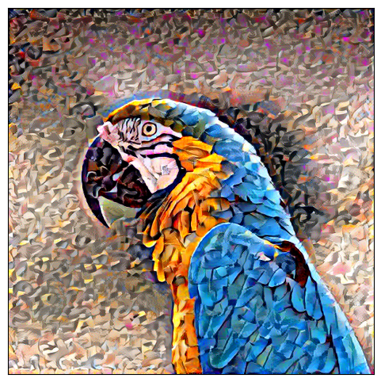
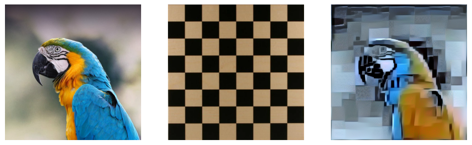

# Neural-Style-Transfer
This project implements Neural Style Transfer (NST) using a pre-trained `VGG19` model.
Neural Style Transfer is a technique that combines the content of one image with the style of another image, creating a new image that merges both.
This is done by optimizing the generated image through a combination of content and style loss functions.

## Project Overview
 * Model Used: VGG19 pre-trained on ImageNet.
 * Content and Style Layers: We use deeper layers for content extraction and shallower layers for style extraction.
 * Optimization: The generated image is optimized to minimize content and style loss.
 * Output: The final output image is a blend of the style image and content image.
All the code for the project can be found in the notebook `Neural Style Transfer.ipynb`.

## Model and Approach

 * Content Layer: We use the deeper convolutional layers of VGG19, like `block5_conv2`, to extract the content features.
 * Style Layers: Style is extracted from multiple layers in the earlier parts of the model, like `block1_conv1`, `block3_conv1`, and `block5_conv1`.

## Loss Functions
### Content Loss
The content loss measures how different the generated image is from the content image. The loss is calculated as the Mean Squared Error (MSE) between the content features and the generated image features:

### Style Loss
The style loss compares the style features of the generated image with the style image. We use the Gram matrix to capture correlations between the different channels of the style features:

## Results
here are some of the results 
**Content Images**:

**Style Image**:

**Output Image**:

This is another example with a different style image: 

